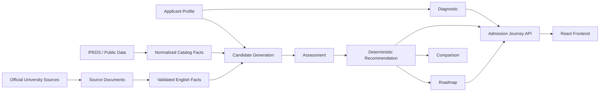

# Talap

**Talap** is an admissions-planning web service for international high-school students applying to U.S. undergraduate programs.

It turns an applicant profile into a connected journey:

**Profile → Diagnostic → Recommendations → Compare → Roadmap**

The product is designed around one principle: **show only what the available evidence supports**. Talap does not invent admission probabilities, “reach/target/safety” labels, rankings, deadlines, scholarship amounts, or program availability when the data is missing.

Talap is being developed for **LOCUS Startup Hackathon 2026 — Case 02: Personal Admission Journey**.

---

## 1. Problem

University admissions information is fragmented across institutional websites, government datasets, catalogs, testing pages, and application guidance.

A student often has to answer several questions at once:

- Which universities are relevant to my goal?
- Does my intended field appear in the available data?
- Do my English-test results satisfy a published requirement?
- What academic information is available for context?
- Which facts are verified and which are still unknown?
- What should I do next?

Talap combines these questions into one explainable admissions workflow instead of returning only a list of universities or an AI chat response.

---

## 2. Product Scope

Current product scope:

- U.S. universities
- Undergraduate / bachelor's admissions
- International high-school applicants
- Initial catalog of 100 deliberately varied institutions
- Known-major and exploration-oriented applicant paths
- English proficiency evidence
- Academic context from public institutional data
- Basic financial constraint awareness
- Deterministic recommendations and roadmap actions

Talap intentionally keeps missing information explicit instead of treating missing data as a negative result.

For example:

- `not_observed` does **not** mean that a university does not offer a program.
- `policy_unavailable` does **not** mean that English testing is not required.
- An inaccessible official source does **not** become a fabricated requirement.
- Historical IPEDS completions do **not** prove that an exact program is currently offered.

---

## 3. User Journey

### 3.1 Profile

The applicant provides relevant information such as:

- intended major / study direction;
- GPA and grading scale;
- graduation timing;
- SAT / ACT scores when available;
- IELTS / TOEFL / Duolingo English Test scores;
- annual budget;
- financial-aid need;
- preferred states;
- excluded states;
- interests for exploration mode.

The profile is validated before it enters the recommendation pipeline.

### 3.2 Diagnostic

Talap summarizes what is present and what is still missing.

Examples:

- missing academic test data;
- missing English-test data;
- missing major/CIP information;
- missing budget information;
- excluded-state hard constraints.

The diagnostic does not assign a fake “readiness percentage.”

### 3.3 Recommendations

Talap creates deterministic recommendation records from the applicant profile and available university evidence.

Current recommendation states include:

- `recommended_for_review`
- `consider_with_actions`
- `insufficient_evidence`
- `excluded_by_applicant`

The UI explains **why** an institution appears and what evidence is incomplete.

Talap does **not** provide an admission probability.

### 3.4 Compare

The applicant can select multiple eligible universities and compare factual dimensions such as:

- recommendation state;
- location;
- program evidence;
- English-policy evidence;
- academic context;
- evidence quality;
- next actions.

The comparison does not declare a winner or assign a hidden score.

### 3.5 Roadmap

Talap converts recommendation evidence into a deterministic action plan.

Current action categories include:

- profile;
- academics;
- English;
- program;
- financial;
- research.

Priorities are generated by backend rules rather than by frontend scoring.

---

## 4. Evidence Model

Talap separates:

1. **source documents**;
2. **normalized facts**;
3. **applicant-specific assessments**;
4. **recommendation decisions**;
5. **roadmap actions**.

This avoids mixing scraped text, model interpretation, and user-facing judgments.

For official-source facts, Talap preserves provenance such as:

- source URL;
- content hash;
- evidence text / validated evidence;
- applicability information;
- fact state;
- data year where available.

Current canonical English facts are only valid when the fact is bound to the current source content hash.

Stale facts may remain in history but must not be exported as current facts.

---

## 5. Data Sources

### U.S. Department of Education / IPEDS

IPEDS-derived data is used for:

- institution identity;
- institutional metadata;
- bachelor-level CIP completion evidence;
- admissions / academic context where available.

Important limitation:

**IPEDS completion records are historical evidence and are not treated as proof that an exact degree is currently offered.**

### Official university sources

Official university-controlled pages are used for current English-proficiency evidence where available.

Preferred source types include:

- undergraduate admissions pages;
- international admissions pages;
- English-proficiency pages;
- official catalogs and bulletins;
- official university PDFs.

Third-party admissions aggregators are not treated as canonical evidence.

### Current English-policy data

The English pipeline supports evidence for:

- IELTS;
- TOEFL iBT 0–120 scale;
- TOEFL iBT 1–6 scale;
- Duolingo English Test;
- waiver / exemption text;
- conditional policies;
- explicit “no published minimum” states;
- unresolved or conflicting evidence.

The two TOEFL scales are kept separate and are never converted into each other.

---

## 6. Recommendation Safety

Talap intentionally avoids unsupported claims.

The product does not generate:

- admission probabilities;
- guaranteed admission;
- reach / target / safety labels;
- fabricated rankings;
- invented application deadlines;
- invented scholarship values;
- invented tuition or net price;
- fake current program availability.

When evidence is unavailable, the interface says so.

This behavior is part of the product, not an error fallback.

---

## 7. Architecture



The recommendation and roadmap core does not require an LLM to function.

---

## 8. Technology Stack

### Backend

- Python
- Django
- Django ORM
- SQLite for local development
- PostgreSQL-compatible data model
- Pydantic v2
- Typer
- Rich
- httpx
- Trafilatura
- pytest
- pytest-django

### Frontend

- React
- TypeScript
- Vite
- Tailwind CSS
- React Router
- Lucide icons
- Vitest
- Testing Library

### AI

- OpenAI API for optional structured extraction from official university source content
- Deterministic validation after extraction
- Source-hash reuse to avoid unnecessary repeated model calls

The recommendation engine itself is rule-based and works without OpenAI.

---

## 9. OpenAI Configuration

**Never commit an API key to GitHub.**

Set secrets only through environment variables or another secret-management mechanism.

PowerShell example:

```powershell
$env:OPENAI_API_KEY="YOUR_KEY_HERE"
$env:OPENAI_BASE_URL="https://api.openai.com/v1"
$env:OPENAI_MODEL="YOUR_OPENAI_MODEL"
```

The repository must not contain the real key.

> **Repository alignment note:** before final submission, confirm that the current extraction adapter reads `OPENAI_*` variables. Older internal development versions used provider-specific `ALEM_*` variable names. Those names should be removed or generalized so the documentation and implementation match.

OpenAI is optional for runtime recommendations. If no API key is configured, deterministic recommendation logic should continue to work.

---

## 10. Repository Structure

A simplified view:

```text
Talap/
├─ frontend/                  React / TypeScript application
├─ src/admission/
│  ├─ applicants/            applicant profile and validation
│  ├─ assessment/            evidence assessment
│  ├─ recommendation/        deterministic recommendation logic
│  ├─ roadmap/               deterministic action planning
│  ├─ journey/               end-to-end admission journey
│  ├─ catalog/               university/source/data pipeline
│  └─ api/                   HTTP API
├─ data/
│  ├─ canonical/             deterministic canonical exports
│  ├─ review/                auditable unresolved/review manifests
│  └─ source_seeds/          reviewed official-source locations
├─ tests/
├─ manage.py
└─ README.md
```

---

## 11. Local Development

### 11.1 Backend

From the repository root:

```powershell
.\.venv\Scripts\python.exe manage.py migrate
```

Then start Django.

If local development settings already allow loopback hosts:

```powershell
.\.venv\Scripts\python.exe manage.py runserver 127.0.0.1:18000
```

If the current settings have `DEBUG=False` with no local `ALLOWED_HOSTS`, use the existing development configuration or configure `localhost` / `127.0.0.1` before running the server.

### 11.2 Frontend

In a second terminal:

```powershell
cd frontend
$env:TALAP_DEV_API_TARGET="http://127.0.0.1:18000"
npm install
npm run dev
```

Then open the Vite URL printed in the terminal, normally:

```text
http://localhost:5173/
```

### 11.3 Important data note

Canonical JSON/JSONL files committed to Git do not automatically become rows in an arbitrary local SQLite database.

A deterministic canonical-data bootstrap/import path is being finalized so a fresh runtime DB can be reconstructed without relying on another developer's `.var/*.sqlite3` file.

Runtime SQLite databases and source caches must not be committed.

---

## 12. Main API Surface

Current application API includes the profile and journey flow.

Representative endpoints:

```text
GET  /api/v1/health/
POST /api/v1/profiles/validate/
POST /api/v1/profiles/
GET  /api/v1/profiles/<profile_key>/
GET  /api/v1/profiles/<profile_key>/diagnostic/
GET  /api/v1/profiles/<profile_key>/journey/
```

The frontend uses the journey response as the shared source for diagnostics, recommendations, comparison, and roadmap presentation.

---

## 13. Testing

### Backend

Run the relevant backend suites:

```powershell
.\.venv\Scripts\python.exe -m pytest -q
```

Django integrity checks:

```powershell
.\.venv\Scripts\python.exe manage.py check
.\.venv\Scripts\python.exe manage.py makemigrations --check --dry-run
```

### Frontend

```powershell
cd frontend
npm test -- --run
npm run lint
npm run build
```

---

## 14. Suggested Jury Test Scenario

A simple end-to-end test:

1. Open Talap.
2. Create an undergraduate international applicant profile.
3. Choose a known major such as Computer Science.
4. Add GPA information.
5. Add an IELTS score.
6. Optionally add SAT / ACT.
7. Enter an annual budget and financial-aid preference.
8. Continue to Diagnostic.
9. Open Recommendations and inspect the explanation for several universities.
10. Select at least two universities.
11. Open Compare.
12. Continue to Roadmap.
13. Return to the profile and change a meaningful input such as:
    - English score;
    - intended major;
    - budget;
    - excluded state.
14. Run the journey again and verify that the output reacts to the changed profile.

The expected behavior is not that every university becomes recommended. The expected behavior is that the result changes only when the underlying evidence and deterministic rules support the change.

---

## 15. Example Interpretation

A university may show:

```text
IELTS
Verified minimum: 7.0
Applicant score: 6.5
Result: Below verified minimum
```

This comparison is deterministic.

For SAT, Talap must not create a fake total-score percentile range by summing IPEDS section percentiles.

A safe presentation is:

```text
Applicant SAT total: 1420 / 1600

University-reported SAT context:
Reading/Writing: 25th ... / 75th ...
Math:            25th ... / 75th ...

Applicant total SAT is not directly compared with section percentile data.
```

---

## 16. Security and Data Handling

- API keys and passwords are never committed to the repository.
- Runtime databases are local artifacts and are not committed.
- Source caches are not committed.
- External-source facts retain provenance.
- Missing evidence remains explicit.
- Source failures do not silently reuse stale current facts.
- The crawler uses a truthful application identity rather than impersonating a consumer browser.
- No CAPTCHA bypass, proxy rotation, stealth scraping, or similar access-control circumvention is part of the data pipeline.

---

## 17. AI / API Disclosure

Talap uses AI only where it provides a clear technical benefit.

### OpenAI

OpenAI may be used for:

- structured extraction from official university source content;
- identifying candidate evidence for deterministic validation.

The model output is not accepted directly as a final university fact.

Extracted candidates pass through deterministic validation and provenance checks before they can appear in canonical data.

### Deterministic core

The following do not require OpenAI:

- applicant validation;
- diagnostics;
- candidate generation;
- hard constraints;
- academic evidence handling;
- English-score comparisons;
- recommendation state assignment;
- roadmap generation;
- comparison semantics.

---

## 18. Pre-existing / Reused Components Disclosure

Hackathon rules allow reusable general-purpose components when they are disclosed.

Before final submission, fill this section accurately.

| Component | Created before the 72-hour period? | How it is used |
|---|---:|---|
| Base project infrastructure | **TODO: confirm** | Repository / local development foundation |
| UI primitives / design-system components | **TODO: confirm** | Buttons, cards, inputs, layout primitives |
| Authentication | Not currently part of the core product | — |
| Third-party libraries | Yes | Standard open-source dependencies listed in project manifests |
| University source data collected before hackathon | **TODO: confirm exact subset** | Must be disclosed if applicable |

Do not claim “none” unless the Git history confirms it.

---

## 19. Team Roles

Fill before submission.

| Team member | Role | Contribution |
|---|---|---|
| **TODO** | Product / Backend / Data / Frontend / Design / Presentation | **TODO** |

If this is a solo project, replace the table with:

```text
Team size: 1
Role: Full-stack development, data pipeline, product design, testing, presentation
```

---

## 20. Known Limitations

These limitations are intentionally documented rather than hidden.

### Data

- English-policy coverage is still incomplete for some universities.
- Some official university websites block automated access; these remain explicit unresolved states.
- Current program evidence relies heavily on IPEDS CIP completion data and does not prove current exact program availability.
- Current cost / scholarship / verified deadline coverage is incomplete.

### Product

- A canonical-data → fresh-runtime-DB bootstrap/import workflow still needs final integration validation.
- SAT total scores must not be compared directly with IPEDS section percentile context.
- Authentication / multi-user accounts are not part of the current core scope.
- Roadmap completion persistence is not yet implemented.
- Verified university-specific application deadlines are not yet comprehensive.
- Mobile/responsive finalization is still pending until the responsive task is completed.


## 21. Why Talap Is Different

Talap is not designed to look confident when the evidence is weak.

Its core differentiator is **evidence-aware personalization**:

```text
Applicant profile
        +
Verified / explicitly unavailable university evidence
        +
Deterministic rules
        ↓
Explainable recommendation
        ↓
Actionable admissions roadmap
```

A missing fact remains missing.

A blocked source remains blocked.

A recommendation explains itself.

That makes the system useful not only as a prototype interface, but as a foundation for a more reliable admissions-planning product.